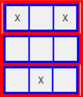
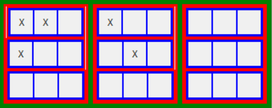
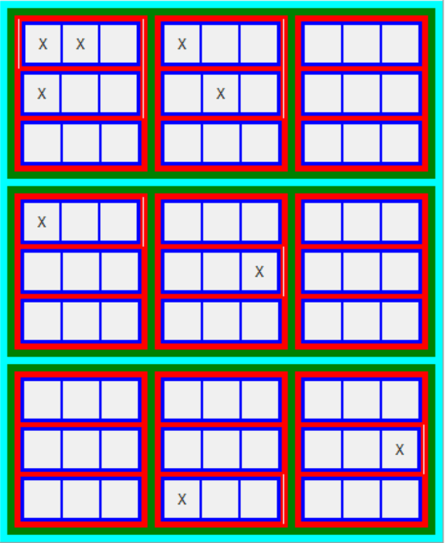

# WXML-Affine-Geometry
This repository contains code for working with the affine space F_3^n. The provided GUI, affineGUI.py allows the user to see a visual representation of F_3^n for any n from 1 to 6. It also allows the user to view subsets of F_3^n by either typing them in in binary or by manually editing the state by checking checkboxes corresponding to desired points. The flat-elim-search and affine_space_core files were written by Jaron Wang, a previous WXML researcher at UW, and they produce a list of caps. The caps we are using for this project are the 2-caps in F_3^4. The other files, invertibleMatrices and verifier, verify that all 2-caps produced by flat-elim-search are affinely equivalent.

### Example maximal 2-caps
2-caps are defined as sets of vectors in F_3^n such that no three points are collinear and no four points are coplanar. A 2-cap is maximal if it is of maximum possible size. The following are examples of maximal 2-caps in 2, 3, and 4 dimensions as expressed by affineGUI

